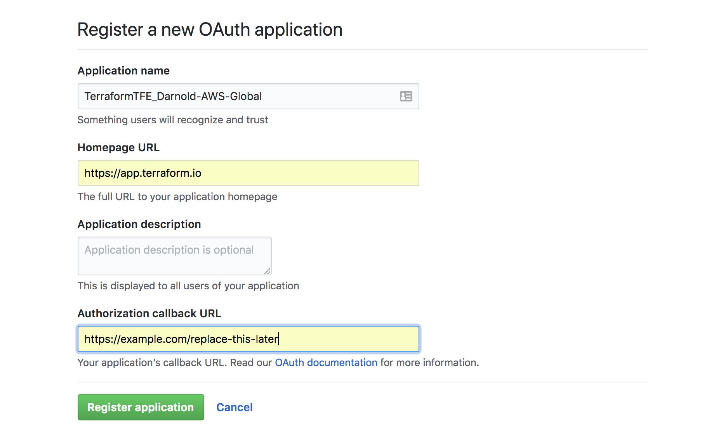
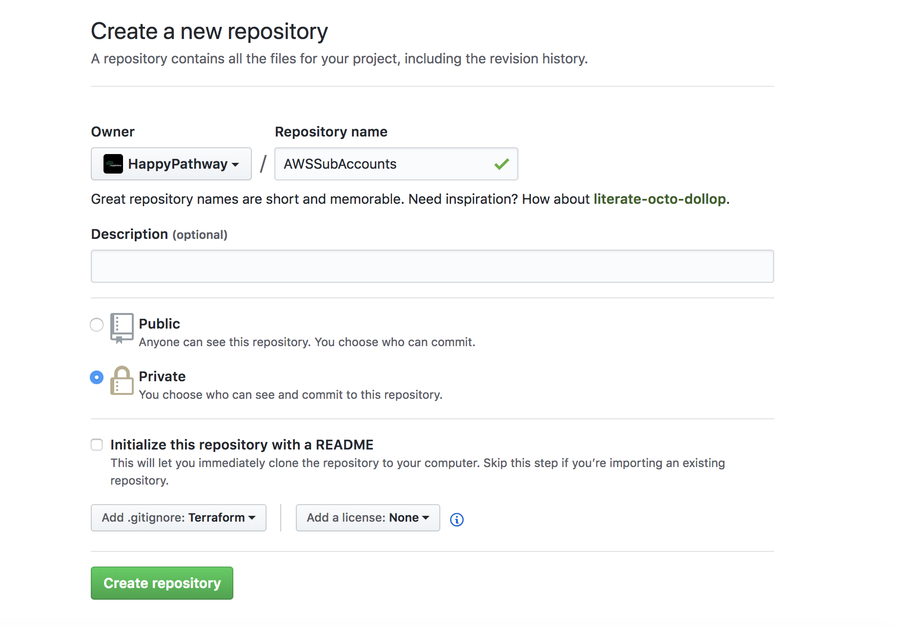
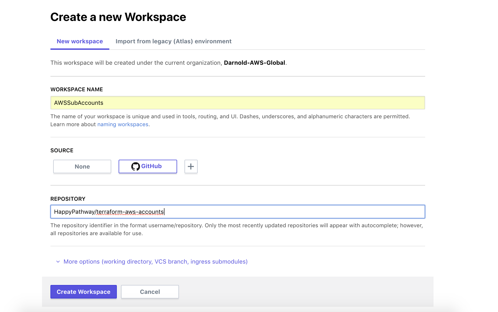

# AWS Account Management through Terraform and Vault AWS/AppRole
First we're gonna go through creating a brand new Terraform Enterprise Organization. In this organization, we will manage all of our AWS Accounts and any other global infrastructure. All the rest of our infrastructure will be delegated to our individual AWS Accounts.


## Connect TFE Organization to GitHub
We're going to create a new GitHub Oauth App. 


## Repository Creation for AWSSubAccounts
We're going to manage all of our sub-accounts from one GitHub repository. We do not want to ever store our Terraform State files in GitHub as there could be unintended secrets that are checked in as well. Since we're going to be mostly managing Terraform code from this repository, we will go ahead and specify the Terraform template for our .gitignore file.


## Workspace Creation for AWS SubAccounts
We're going to manage all of our sub-accounts from one workspace. In this workspace we will need to upload our Root Account IAM Credentials. *This should not be confused with root user credentials. Here we are only providing credentials that are tied to IAM accounts that are able to create sub-accounts. 


### Workspace Variable Setup
```bash
push_vault_env Darnold-AWS-Global AWSSubAccounts

push_aws Darnold-AWS-Global AWSSubAccounts

source ~/.tfe/Darnold-AWS-Global
tfe pushvars -name ${TFE_ORG}/AWSSubAccounts -var "aws_account_email=${AWS_ACCOUNT_EMAIL}" -var "aws_account_name=${AWS_ACCOUNT_NAME}"
```

[push_vault_env code ](https://gist.github.com/djaboxx/f6d7c6adac9b18028e9ef347c14eb89d)
[push_aws code ](https://gist.github.com/djaboxx/a6ef280f16495b7c533a7b9ddd807acc)